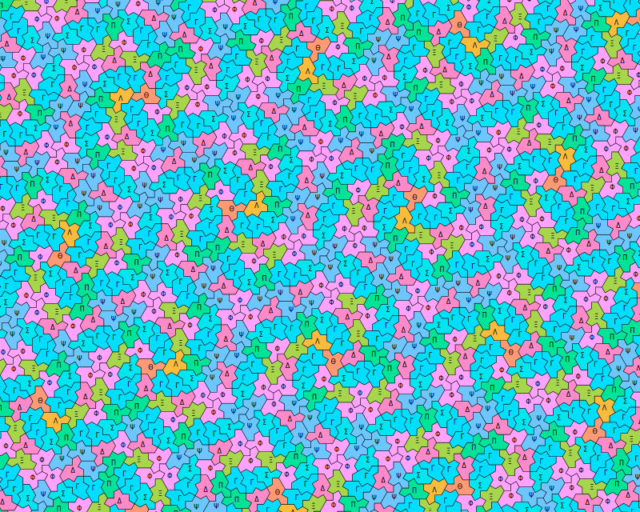

# Aperiodic



This is a Haskell implementation of the algorithms proposed in the [four part series](https://www.chiark.greenend.org.uk/~sgtatham/quasiblog/aperiodic-tilings/) blog post by Simon Tatham. You can also read my own presentation [here](https://trebor-huang.github.io/forest/tile-0001.xml).

This depends on the [Kleenex](https://github.com/diku-kmc/kleenexlang/) program. I am using a custom local fork for now, so you need to edit the extra dependencies in `stack.yaml` yourself. You may also need to edit the dependency information of that library to make it compile.

See `Main.hs` for an example tiling generation. Also see the `Tilings` folder for examples if you want to run it on your own tiling system.

## Input format

A substitution tiling system involves some tiles, and a set of rules that expands a tile into several smaller tiles. Our algorithm needs to know the combinatorial structure of this system, like which edges touch each other, etc.

```hs
import Geometry
import Substitution
import Automata
import Kleenex
import qualified Data.Set as S
```

To define a tiling system, you need to define

- the type of prototile labels, i.e. the different possible shapes;
- the type of subtile labels, i.e. when you expand a tile, we need labels to refer to each subtile;
- the type of edge labels;
- the type of subedge labels, i.e. when you expand a tile into smaller tiles, each edge will become several shorter edges, and we need to label them;
- and the type of *stages*, which is only relevant if your substitution system has multiple ways to expand tiles. For example in the spectre tiling, we start with a lot of hexagons, and in the final step we substitute each hexagons with spectres. In this case we need two different stages. If you don't need this, just use the unit type `()`. If you have multiple stages, the different stages should use different subtile labels.

All of these should have `Eq, Ord, Enum, Bounded` instances (and probably `Show`).

If two edges are compatible, you must use the *same* labels for the subedges. So if one type of edge has subedges labelled counterclockwise, the matching type of edge should have subedges labelled clockwise, so that when they match up, the same label is used for touching subedges. (Note that this basically forbids an edge from touching itself. If your system has that, you need to split that edge in half, so that the left half only matches the right half.)

The first piece of information is the **automaton**, which tells the program what tiles occurs in the expansion of what tile. It is defined in this way:
```hs
automaton :: FSA (Alphabet Tile Subtile Edge) (Maybe Tile)
automaton = FST {
  states = ["a set of all possible tiles, together with Nothing"],
  transitions = [
    (Nothing, Begin tile edge, (), Just tile),
      -- for all tiles and all valid edges of that tile
    (Just tile, Inflate tile' subtile, (), Just tile')
      -- whenever the expansion of tile' includes tile as a subtile
  ]
}
```
Next is the **system**, which tells the program how the edges are connected in an expansion.
```hs
-- | Intended for functions that form a perfect pairing,
-- i.e. it maps every element to its companion, and vice versa.
-- so f . f = id, and f has no fixed points.
type Pairing a = a -> a

system :: SubstSystem Tile Subtile Edge Subedge Stage
system = SubstSystem {
  -- | Input a tile and one of its subtile label,
  -- output what kind of tile that subtile is.
  -- This info is technically contained in the automaton,
  -- but I'm too lazy to write the conversion.
  subtile :: Tile -> Subtile -> Tile,
  -- | Given a subtile label, output what stage of expansion it belongs to.
  stageMap :: Subtile -> Stage,
  -- | Given a tile (in a specific expansion stage), we need to specify
  -- a pairing on the edges of the smaller tiles in its expansion, i.e.
  -- which edges are touching each other. Some edges are on the "outside",
  -- so they don't touch anyone else. In this case they are paired against
  -- a subedge of the original larger tile.
  substMap :: Stage -> Tile -> Pairing (Either (Edge, Subedge) (Subtile, Edge))
}
```
See [this](https://trebor-huang.github.io/forest/tile-0008.xml) for a more thorough explanation. That page also defines colors of edges, but they don't play any role computationally, so we don't need them.

This is already enough to deduce all the neighborhood information. To specify a tile, use Conway signatures:
```hs
data Signature tile subtile = tile :< [(tile, subtile)]
infix 4 :<
```
which describes a tile, which is a subtile in the expansion of some other tile, which is a further subtile of another tile, etc. This list can be infinite.

Write
```hs
transducer = induceFromFunction (adjRec system) automaton
streamer = toKMC (numberStates (normalizeMachine transducer))
```
to compile some automata used for faster generation.

Of course, you still need some geometric information to actually draw the tilings. This part only deals with 2D tilings, while all the other algorithms work in arbitrarily many dimensions. We need
- A computable subgroup of 2D transformations. Since for most tilings this just means rotations, i.e. angles, the typeclass is called `SO2 a`. It is just a monoid with `invert` making it a group. For example, we can make a group `Mod10` given by the integers mod 10, representing the 10 rotations by multiples of 36 degrees.
- A type of vectors. We need a monoid instance representing vector addition, and a `Vector2 rot vec | vec -> rot` instance, implementing the rotation of vectors. You only need to deal with vectors that appear in the tiling. For example, in the Penrose tiling, we only need to consider _integer_ multiples of `(cos 2kπ/5, sin 2kπ/5)` and their sums, so we can make a datatype recording the integer coefficients, making the computations exact.
- Of course, we need a way to convert this into actual `(Double, Double)` coordinates. This is defined in the typeclass `Draw2D vec`.
- Finally, the most important part is to define the edges of tiles.
```hs
data Tiles tile edge rot vec = Tiles {
  edges :: tile -> [edge],
  edgeMap :: tile -> edge -> (rot, vec)
}
```
Note that the `edgeMap` specified both a rotation and a vector for convenience. However, when two edges are compatible under matching rules, their vector must be pointing in the opposite direction, and you should use the rotation to specify their actual orientation.


## Algorithms

We have three algorithms `Signature tile subtile -> edge -> Maybe (Signature tile subtile, edge)` that generate the combinatorial structure of the tilings. They are given a tile (specified by the Conway signature), and an edge of that tile, and they will output the neighbor, together with its matching edge, if it exists. They are drop-in replacements, so you can just swap them in and out freely when you test things.

- The recursive algorithm `adjRec system` is the simplest, but it hangs on some infinite inputs. On finite inputs, it sometimes only produces partial results, i.e. some tiles are determined by the input, but the algorithm cannot recognize them and gives up.
- The naive transductive algorithm `adjFST transducer` is very slow, needs to read the entire input before producing the answer (and hence does not handle any infinite input), but it will calculate all the tiles that are determined by the input (and connected to the starting tile).
- The streaming transductive algorithm `adjSST streamer` combines the pros of the previous two. It is about as fast as the recursive algorithm, handles infinite inputs and produces the complete answer.
- The last two algorithms need some time compiling their automata, for spectre tiles this takes about half a minute, and for Penrose tiles this is almost immediate.

Some periodic infinite inputs can't be handled because even the first token of the output cannot be determined without knowing about the periodicity. Since the input format is an arbitrary infinite list, no algorithm can handle this. I might write another algorithm that specifically deals with these rational inputs, by including the period information in the input format.
